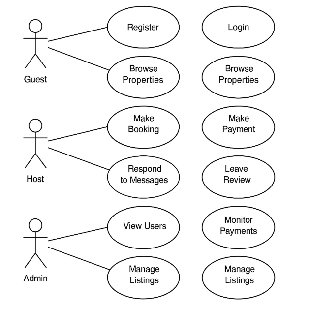

# Use Case Diagram – Airbnb Clone

This diagram visualizes the key interactions between system users and the Airbnb Clone backend functionalities.

## Actors
- Guest
- Host
- Admin

## Key Use Cases
- **Guest**: Register, Login, Browse Properties, Book Property, Make Payment, Leave Review
- **Host**: List Property, Manage Bookings, Communicate with Guests
- **Admin**: View Users, Approve Listings, Monitor System

## Diagram
